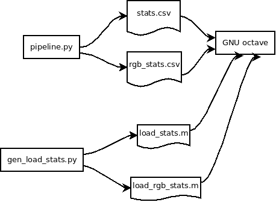
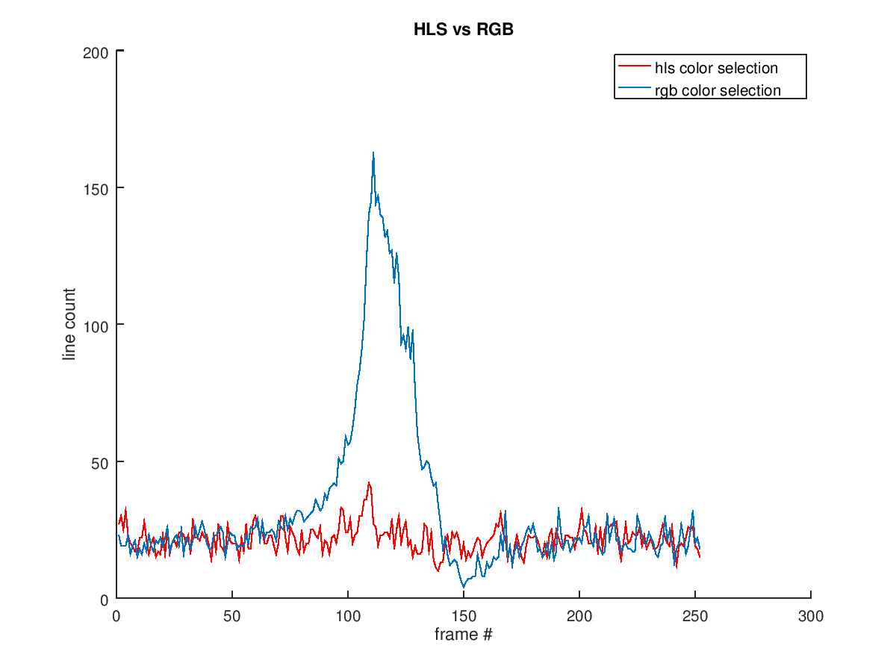
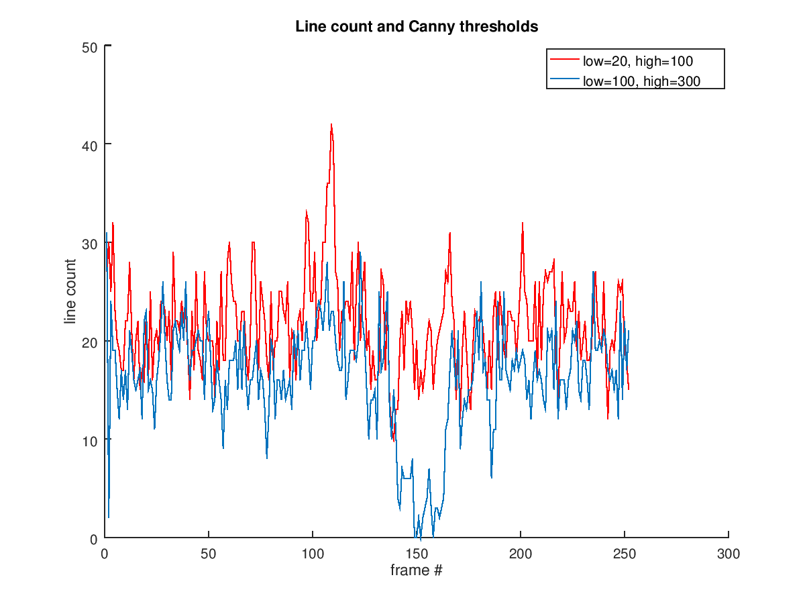
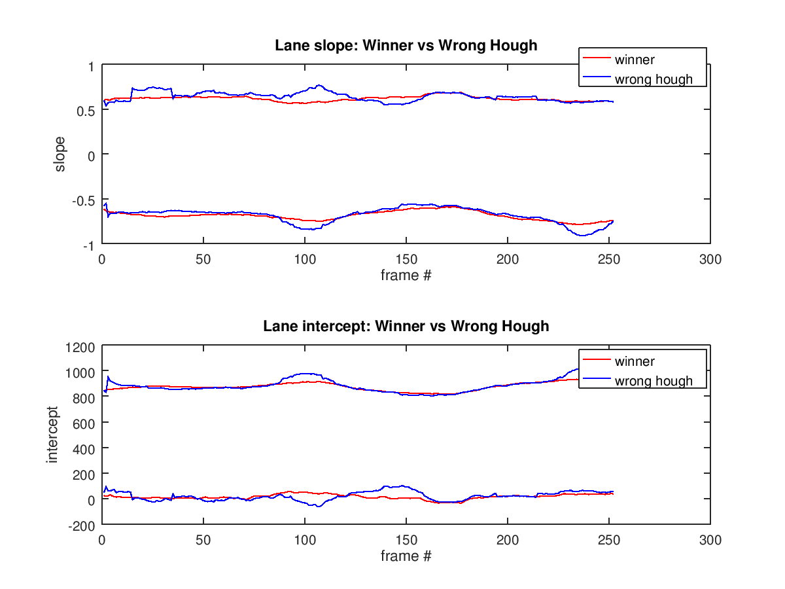
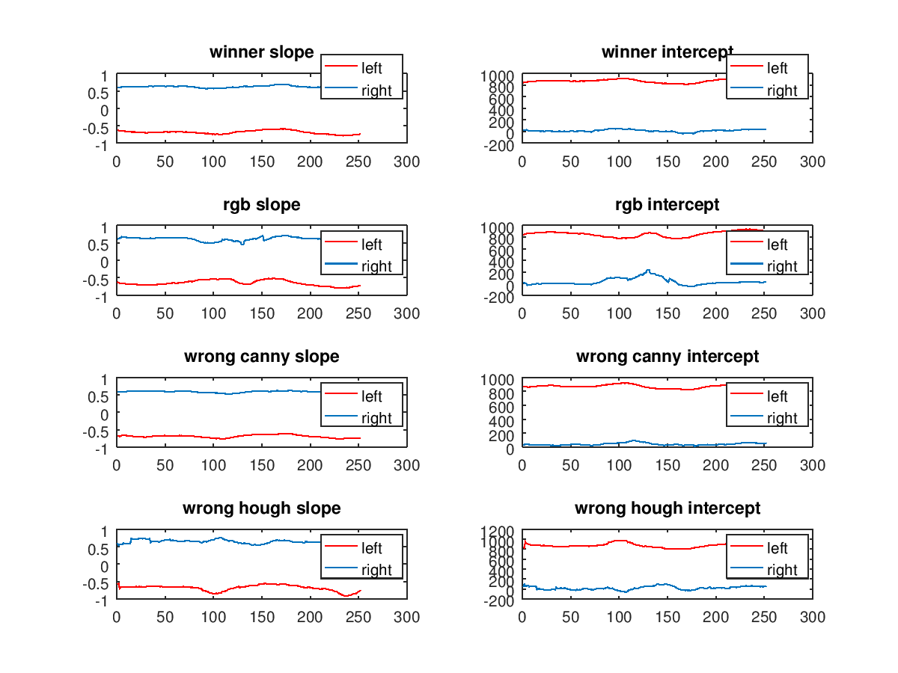
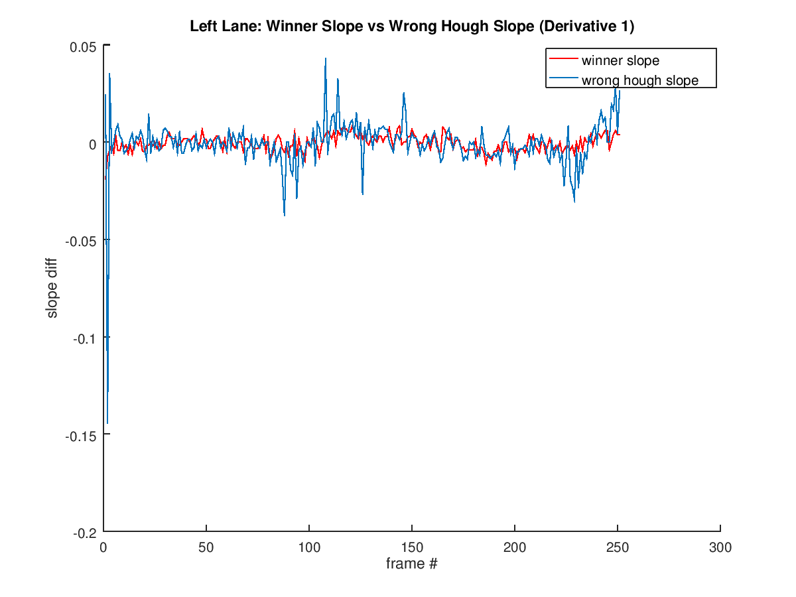

Lane Lines Detection Writeup
============================

The greatest challenge was the choice of metrics. In order to collect
some useful data I wrote `pipeline.py` and several GNU octave scripts:

\ 

`pipeline.py` generates CSV files that contain a lot of numbers =)
Several numbers turned out to be useful.
  
As I found out, the most useful metrics are

  * line count -- reflects the quality of colors selection (it seems so) and shows whether Canny parameters are chosen well
  
  * left/right lane slope/intercept -- shows whether Hough parameters are chosen well

Here are some pictures that illustrate my findings.

(I known it's better to use just one metric, but ... you know ... I will improve ... I promise)

**Note:** Only *Challenge* clip illustrations can be found here (because *Challenge* is the most challenging)

## Color selection

I used the HLS color space, and the following picture shows why I did so:

\ 

`line count` plot for RGB is so crazy that it drives me mad. The blue
peak is particulary irritating =) I don't think it is OK. And I don't
think it's a coincidence because it appears right in the area with the
shadow.

In addition, here're the moments for `line count`:
  
  * HLS: mean 19.722, std 4.3960
  
  * RGB: mean 27.484, std 25.703

Looks like HLS wins.

## Canny thresholds

What I was trying to do is to minimize `line count` after the Canny
step, but I realized that a too small `line count` is also no
good. So, I chose a variant when Canny returns 20 lines in average.

\ 

What's more, the moments turned out to be informative:

  * Red series moments: mean 21.6786, std 4.86018
  
  * Blue series moments: mean 16.2063, std 5.67137

## Hough parameters

I decided that `slope` and `intercept` should not change abruptly. It
is important to choose the right Hough parameters:

\ 

*Winner* Hough parameters: 

  * `rho`: 2
  
  * `theta`: pi / 180
  
  * `threshold`: 20
  
  * `min_line_length`: 20
  
  * `max_line_gap`: 400
  
*Wrong* Hough parameters: 

  * `rho`: 2
  
  * `theta`: pi / 180
  
  * `threshold`: 10
  
  * `min_line_length`: 10
  
  * `max_line_gap`: 40

However, this is not enough. Color selection and Canny parameters are also influential:

\ 

The pictures above show values of `scope` and `intercept`, but, in fact,
it is better to use derivatives (I realized it later):

\ 

Here's another irritating peak.

Conclusion
==========

  * I need more than one week to understant it ALL

  * It's better to have a separate script for each Tested Pipeline
  
  * It's better to have an external configuration file with Pipeline parameters
  
  * I know that there're Illumination Invariant representations of
    images, and I think they should be better ...
	
  * I ommited the Noise analysing step, and this might be a path for imporvement
  
  * I think my pipeline will go nuts on the curvy road in the mountains

